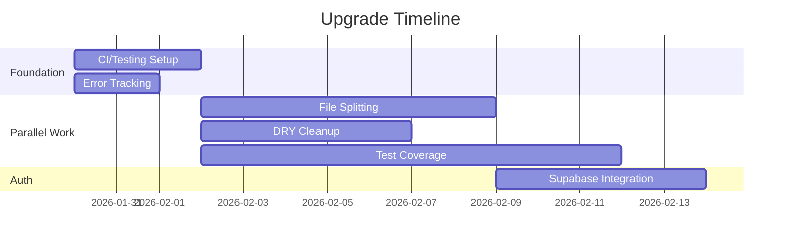

# FormulaStudio Upgrade Plan

**Project:** FormulaStudio Beta Stabilization & Team Scaling  
**Duration:** 4-6 weeks  
**Team:** 1-3 developers + AI assistants

---

## Executive Summary

This plan consolidates the architecture review and testing strategy into an actionable upgrade roadmap. The work is organized into **parallel workstreams** that can be executed simultaneously by different people or AI agents.

> [!IMPORTANT]
> **Key Insight:** Most tasks are independent and can be parallelized. Only testing infrastructure must be completed before writing new tests.

---

## Phase Overview



---

## Workstream Breakdown

### 🔴 Workstream A: Foundation (Must Complete First)

These tasks create the infrastructure that other work depends on.

| Task | Est. Time | Can Use AI? | Dependencies |
|------|-----------|-------------|--------------|
| A1. Set up CI pipeline | 2 hours | ✅ Yes | None |
| A2. Configure test coverage | 1 hour | ✅ Yes | None |
| A3. Add error tracking (Sentry) | 2 hours | ✅ Yes | None |
| A4. Write CONTRIBUTING.md | 1 hour | ✅ Yes | None |

**Parallelization:** A1-A4 can all run simultaneously in separate AI chats.

---

### 🟡 Workstream B: File Splitting (Parallelizable)

Split large files into smaller, AI-IDE-friendly modules.

| Task | File | Target | Can Use AI? | Dependencies |
|------|------|--------|-------------|--------------|
| B1. Split FeedbackWidget | 571→4 files | 150 lines each | ✅ Yes | A1 (CI) |
| B2. Split EditorView | 541→3 files | 180 lines each | ✅ Yes | A1 (CI) |
| B3. Split QuizLevel | 471→3 files | 160 lines each | ✅ Yes | A1 (CI) |
| B4. Separate parser/tokenizer | 407→2 files | 200 lines each | ✅ Yes | A1 (CI) |

**Parallelization:** B1-B4 can all run simultaneously in separate AI chats. Each is an isolated refactor.

---

### 🟢 Workstream C: DRY Cleanup (Parallelizable)

Extract shared code patterns.

| Task | Scope | Can Use AI? | Dependencies |
|------|-------|-------------|--------------|
| C1. Create visualizer CSS module | 20 components | ✅ Yes | A1 (CI) |
| C2. Create FunctionViewWrapper | 20 components | ✅ Yes | C1 |
| C3. Add JSDoc types to lib/ | 8 files | ✅ Yes | A1 (CI) |
| C4. Create constants file | Magic strings | ✅ Yes | A1 (CI) |

**Parallelization:** C1, C3, C4 can run simultaneously. C2 depends on C1.

---

### 🔵 Workstream D: Test Coverage (Parallelizable after A2)

Add tests to reach 70% coverage target.

| Task | File/Area | Target Coverage | Can Use AI? | Dependencies |
|------|-----------|-----------------|-------------|--------------|
| D1. Expand parser tests | parser.js | 95% | ✅ Yes | A2 |
| D2. Expand interpreter tests | interpreter.js | 95% | ✅ Yes | A2 |
| D3. Add curriculum tests | chapter*.js | 80% | ✅ Yes | A2 |
| D4. Add EditorView tests | EditorView.jsx | 60% | ✅ Yes | A2, B2 |
| D5. Add integration test | Formula flow | N/A | ✅ Yes | A2 |

**Parallelization:** D1-D3 can run simultaneously. D4 depends on B2. D5 can run anytime after A2.

---

### 🟣 Workstream E: Auth & Persistence (After B-Series)

Add Supabase for user authentication and training progress.

| Task | Scope | Can Use AI? | Dependencies |
|------|-------|-------------|--------------|
| E1. Set up Supabase project | External | ❌ Human | None |
| E2. Create auth context | New files | ✅ Yes | E1 |
| E3. Add login UI | New component | ✅ Yes | E2 |
| E4. Create progress table | Database | ✅ Yes | E1 |
| E5. Integrate with Training | TrainingCenter.jsx | ✅ Yes | E3, E4 |

**Parallelization:** E2-E3 and E4 can run in parallel after E1.

---

## Execution Order

```
WEEK 1 (Foundation)
├── Day 1-2: A1, A2, A3, A4 (all parallel, 4 separate chats)
│
WEEK 2-3 (Parallel Refactoring)
├── Chat 1: B1 (FeedbackWidget split)
├── Chat 2: B2 (EditorView split)  
├── Chat 3: B3 (QuizLevel split)
├── Chat 4: C1 → C2 (DRY cleanup, sequential)
├── Chat 5: D1, D2, D3 (test coverage, can be one chat)
│
WEEK 4 (Auth)
├── Human: E1 (Supabase setup)
├── Chat 6: E2, E3 (auth integration)
├── Chat 7: E4, E5 (progress tracking)
│
WEEK 5 (Polish)
├── Chat 8: D4, D5 (remaining tests)
├── Chat 9: C3, C4 (JSDoc + constants)
```

---

## Detailed Task Instructions

### A1. Set Up CI Pipeline

**Context needed:** Just show the AI the repo structure  
**Prompt for AI:**
```
Set up a GitHub Actions CI workflow that:
1. Runs on every PR to main
2. Runs `npm ci`, `npm run lint`, `npm run test`, `npm run build`
3. Fails the PR if any step fails
Create .github/workflows/ci.yml
```

**Verification:** Create a test PR, see if checks run.

---

### A2. Configure Test Coverage

**Context needed:** Show vitest.config.js and package.json  
**Prompt for AI:**
```
Install @vitest/coverage-v8 and configure coverage reporting.
Set up coverage thresholds: 70% overall, 90% for src/lib/
Add `npm run test:coverage` script.
```

**Verification:** Run `npm run test:coverage`, see report.

---

### B1. Split FeedbackWidget

**Context needed:** Show complete FeedbackWidget.jsx file  
**Prompt for AI:**
```
Split FeedbackWidget.jsx (571 lines) into:
1. FeedbackWidget.jsx - Main component (~150 lines)
2. FeedbackWidget.styles.js - Style constants
3. hooks/useCanvasDrawing.js - Canvas drawing logic hook
4. api/feedbackApi.js - API submission logic

Keep the same functionality, just reorganize. Run tests after.
```

**Verification:** 
- `npm run build` succeeds
- Feedback widget still works (manual test: click bug icon, draw, submit)

---

### B2. Split EditorView

**Context needed:** Show complete EditorView.jsx file  
**Prompt for AI:**
```
Split EditorView.jsx (541 lines) into:
1. EditorView.jsx - Main orchestrating component (~180 lines)
2. hooks/useExamples.js - Example loading logic
3. components/EditorToolbar.jsx - Toolbar buttons
4. components/EditorPanels.jsx - Panel layout

Keep the same functionality, just reorganize.
```

**Verification:**
- `npm run build` succeeds
- `npm run test` passes
- Explorer view still works (manual: enter formula, see visualization)

---

### C1. Create Visualizer CSS Module

**Context needed:** Show 2-3 visualizer component files  
**Prompt for AI:**
```
The visualizer components in src/features/visualizer/components/ 
have duplicated inline styles. Create:
1. visualizer.module.css with shared classes
2. Update all 20 components to use the CSS module
3. Remove inline style objects

Focus on: container styles, header styles, result pills, value boxes.
```

**Verification:**
- `npm run build` succeeds
- Visualizer still renders correctly (manual: enter `{{if equals x "y" "yes" "no"}}`)

---

### D5. Add Integration Test

**Context needed:** Show parser.js and interpreter.js  
**Prompt for AI:**
```
Create an integration test in src/lib/integration.test.js that tests
the complete formula flow:
1. Input formula string
2. Tokenize
3. Parse to AST
4. Interpret with sample data
5. Verify output

Test at least 5 different formula types.
```

**Verification:** `npm run test` includes integration tests and passes.

---

### E2. Create Auth Context

**Context needed:** Show App.jsx and provide Supabase URL/key  
**Prompt for AI:**
```
Create Supabase authentication integration:
1. src/lib/supabase.js - Supabase client
2. src/contexts/AuthContext.jsx - Auth provider
3. Wrap App with AuthProvider
4. Export useAuth hook

Support: email/password login, Google OAuth, session persistence.
Do not add UI yet, just the context.
```

**Verification:**
- `npm run build` succeeds
- Console log shows Supabase connection

---

## One Chat vs Multiple Chats Decision Guide

| Scenario | Recommendation | Reason |
|----------|---------------|--------|
| Foundation tasks (A1-A4) | 4 separate chats | Independent, fast |
| File splitting (B1-B4) | Separate chats | Touch different files |
| DRY cleanup (C1-C4) | 1-2 chats | C2 depends on C1 |
| Test coverage (D1-D5) | 1 chat | Shared testing context |
| Auth (E2-E5) | 1 chat | Sequential dependencies |
| Everything | Multiple chats | Faster overall |

> [!TIP]
> **AI Context Limits:** Each file split (B1-B4) should be its own chat because the AI needs to see the entire file being split. Don't try to split multiple large files in one chat.

---

## Verification Plan Summary

| Task | How to Verify |
|------|---------------|
| All code changes | `npm run build` must succeed |
| All refactors | `npm run test` must pass |
| CI setup | Create test PR, see checks |
| Coverage config | `npm run test:coverage` shows report |
| Manual UI changes | Follow specific test steps above |

---

## Risk Mitigation

1. **Always run tests after each refactor** - Catch breaks immediately
2. **Merge Foundation (A-series) first** - Creates safety net
3. **One file split per PR** - Easy to review and revert
4. **AI verifies its own changes** - Ask AI to run build/test after each task

---

## Success Criteria

- [ ] CI blocks PRs with failing tests
- [ ] Test coverage ≥ 70%
- [ ] No files > 300 lines
- [ ] All inline styles extracted
- [ ] Users can log in and save progress
- [ ] CONTRIBUTING.md exists
